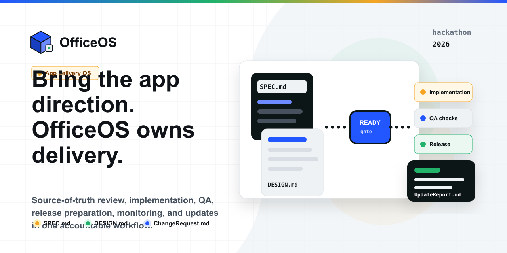
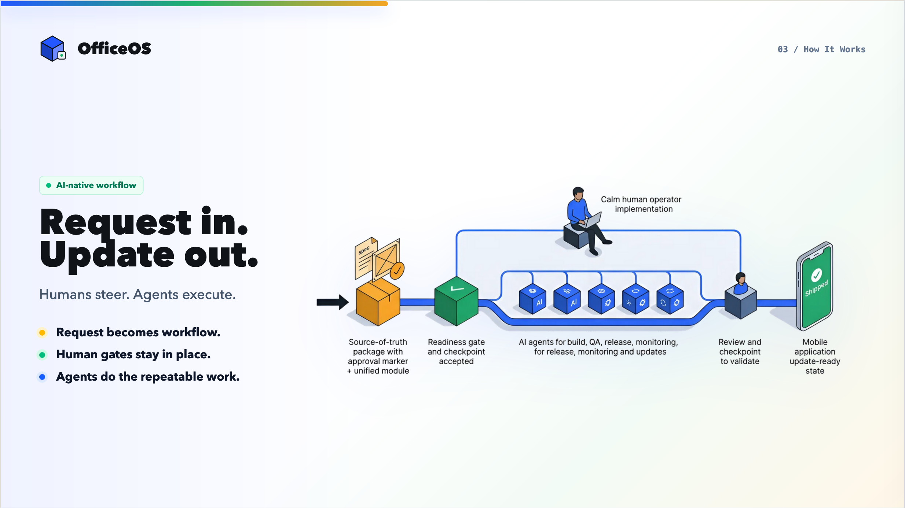
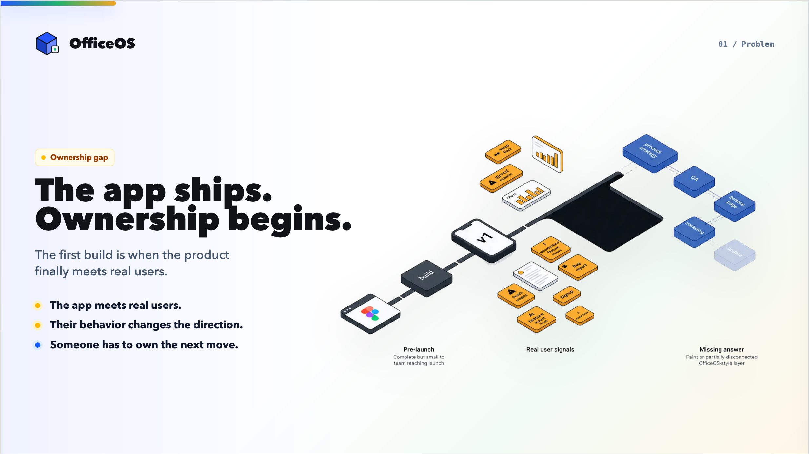
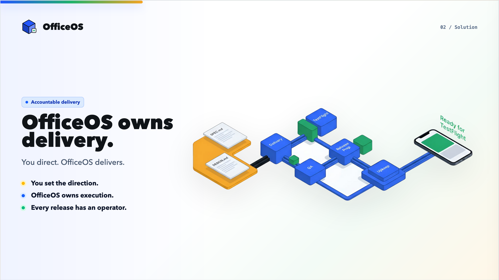

# OfficeOS

  

**Demo**

https://github.com/user-attachments/assets/44f502a6-6fb4-4725-88a0-d55bb4832caf

**Code got cheaper. Mobile app ownership did not.**

OfficeOS is the app delivery OS for app-ready founders, small teams, and agencies that know what app they want, but do not want to run the mobile production lifecycle themselves.

The point is not that OfficeOS can help create an app. The point is that first builds are no longer the scarce part. The scarce part is turning changing product direction into shippable mobile releases without forcing the customer to manage specs, missing screens, QA, App Store readiness, analytics, paywalls, monitoring, and maintenance.

OfficeOS proves a narrower bet: the winning layer is not another code generator. It is the accountable operating layer between "we know what the app should become" and "the app is live, tested, updated, and still moving."

## The Differentiation

Most app tools stop where the hard ownership starts.

- **Dev tools** help teams build faster, but the customer still has to operate the delivery process.
- **No-code tools** reduce the build barrier, but the customer still has to define edge states, validate completeness, release, monitor, and iterate.
- **Agencies** can own delivery, but they are expensive, project-scoped, and built around handoffs.
- **The status quo** is a Figma file, web app, spreadsheet, abandoned version one, or a codebase nobody wants to operate.

OfficeOS takes the opposite position: the customer should own product direction, not mobile delivery operations.

The customer owns:

- Product direction
- Design direction
- Requirements
- Change requests
- Acceptance decisions

OfficeOS owns:

- Delivery readiness
- Source-of-truth control
- Implementation workflow
- QA and acceptance checks
- Release preparation
- Monitoring handoff
- Maintenance and update delivery

That ownership split is the product.

## The Wedge

Apps are living products. Version one is the first moment the product meets real users.

After launch, users get stuck in unexpected places, ignore features that seemed important, request new flows, expose missing edge states, and change what the app needs to become. That is where many app projects break: the product owner can describe the desired change, but does not want to operate the mobile delivery lifecycle every time the app needs to move.

OfficeOS starts with teams that already have clear app direction: a spec, Figma file, client request, product brief, or existing app update. They are not looking for a blank-canvas brainstorming tool. They are looking for a way to turn direction into controlled releases.

## The Mechanism

OfficeOS makes the source of truth the contract between product direction and app delivery.

1. The customer submits `SPEC.md`, `DESIGN.md`, referenced assets, or a change request.
2. OfficeOS checks whether the package is complete enough to build.
3. Incomplete direction stops at the readiness gate instead of becoming hidden delivery debt.
4. Approved direction enters implementation, QA, release preparation, and operating setup.
5. The shipped version becomes the live baseline.
6. Future updates start as `ChangeRequest.md`.
7. OfficeOS converts the request into source-of-truth changes before implementation starts.

The rule is simple: when the source of truth changes, the app changes. When the source of truth is incomplete, implementation does not start.

## What The Demo Proves

The prototype shows the post-launch loop, not only the first build.

A customer submits an app update request. OfficeOS turns that request into delivery artifacts, moves the work through implementation and QA, prepares the release, and produces an update report. The delivered version becomes the new live baseline.

The demo is intentionally focused on the operating layer:

- Intake for app direction and change requests
- Source-of-truth review before implementation
- Delivery readiness as a gate
- Implementation and QA state
- Release preparation
- Update reporting
- A repeatable loop for future changes

That is the core claim: OfficeOS is valuable because apps keep changing, and somebody has to own the system that turns those changes into shipped releases.

## Why Now

AI has collapsed the cost of producing code. That makes the old app-delivery bottleneck more visible, not less important.

When more people can create first builds, more people hit the next wall: product definition, missing requirements, review cycles, app store rules, release sequencing, analytics, monetization, monitoring, and updates. The market does not need another tool that says "generate an app." It needs a layer that keeps the app shippable after the first version exists.

OfficeOS is that layer: app direction in, source of truth accepted, release shipped, update loop owned.

## Source Materials

- [Miro slides board](https://miro.com/app/board/uXjVHJdkql8=/?share_link_id=49241611693)
- [Demo video](Assets/DemoVid.mp4)
- [Problem slide](Assets/1-Problem.png)
- [Solution slide](Assets/2-Solution.png)
- [How it works slide](Assets/3-HowItWorks.png)
- [Hackathon scoring guide](HackathonScoring.md)
- [Hackathon logistics](HackathonLogistics.md)
- [Brand identity](OfficeOsBrandIdentity.md)
- [Pitch notes](OfficeOsPitch.md)
